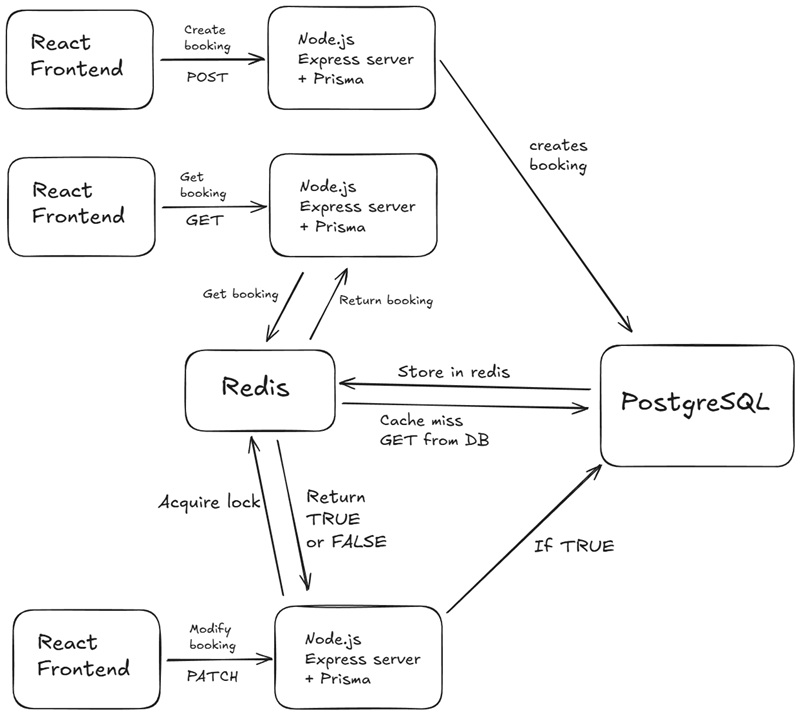

# Air Cargo

A full-stack app for booking and tracking air cargo shipments. Built using the PERN stack 

-----

## Stack

  - **Framework**: React (Vite) & Node.js (Express)
  - **Language**: TypeScript
  - **Database**: PostgreSQL
  - **ORM**: Prisma
  - **UI**: Tailwind CSS
  - **Caching**: Redis
  - **Loggiing**: Winston
  - **Testing**: jest

-----

## Project Structure

### DB Schema (`/air-cargo-api/prisma/schema.prisma`)

  - `Booking`: Holds all the info for a cargo booking, like origin, destination, weight, and status.
  - `Flight`: Stores flight details. Not really used much in the final app but it's there.
  - `BookingEvent`: A log for each booking. Every time the status changes (e.g., 'departed'), a new event is created here.

### API Routes (`/air-cargo-api/src/controllers`)

  - `/api/bookings`:
      - `POST /`: Creates a new booking.
      - `GET /:refId`: Gets a single booking's details.
      - `PATCH /:refId/depart`: Updates status to 'DEPARTED'.
      - `PATCH /:refId/arrive`: Updates status to 'ARRIVED'.
      - `PATCH /:refId/deliver`: Updates status to 'DELIVERED'.
      - `PATCH /:refId/cancel`: Cancels the booking.
  - `/api/flights`:
      - `GET /`: Gets a list of all flights.

### Frontend Routes (`/air-cargo-ui/src/pages`)

  - `/`: The main page to create a new booking (`CreateBooking.tsx`).
  - `/search`: A page to look up a booking by its ID (`SearchBooking.tsx`).
  - `/booking/:refId`: Shows the details and timeline for a specific booking (`BookingDetail.tsx`).
  - `/manage`: An "admin" page to search for a booking to update (`ManageBookingSearch.tsx`).
  - `/manage/:refId`: The "admin" page where you can actually update the booking status (`ManageBookingDetail.tsx`).

-----

## Local Development

#### 1\. Clone & Install

```bash
git clone https://github.com/janardannn/air-cargo.git
cd air-cargo

# Install backend deps
cd air-cargo-api
npm i

# Install frontend deps
cd ../air-cargo-ui
npm i
```

#### 2\. Environment Variables

```env
# /air-cargo-api/.env

DATABASE_URL=""

REDIS_HOST=""
REDIS_PORT=""
REDIS_USERNAME=""
REDIS_PASSWORD=""

FRONTEND_URL="http://localhost:5173"
```

Env for frontend
```env
VITE_API_BASE_URL="http://localhost:3000/api"
```

#### 3\. Database Setup

From the `air-cargo-api` directory, run:

```bash
# Apply the schema to your database
npx prisma db push
```

#### 4\. Run Server


```bash
# Run the backend
cd air-cargo-api
npm run dev
```

```bash
# Run the frontend
cd air-cargo-ui
npm run dev
```

The app will be running at `http://localhost:5173`.

-----

## High Level Design



-----

## System Architecture

ok so how this thing works is its basically two different projects, a frontend and a backend, that just talk to each other.

**The frontend** is just the website you see. its a react app. all it does is show you the buttons and forms and stuff. it has no idea where the data comes from, its pretty dumb lol. all it does is use this thing called `axios` to send a message to the backend whenever you click something. like when you type in a booking id and hit search, it just takes that id and lobs it over to the backend's url and hopes for the best.

**The backend** is where all the real stuff happens. its a node.js server thats running all the time. when a request comes in from the frontend, it actually does the work.

1.  **How it works:** So a request comes into the express server. express looks at the url, like `/api/bookings/AC001001`, and figures out which bit of my code to run. it sends it over to the `booking.controller.ts` file.

2.  **Checking the cache:** The controller calls my `BookingService`. The first thing this service does is check Redis. Redis is a caching layer. it checks if it already has the data for `AC001001` saved. if you looked this up recently, it'll be in there, and the backend just sends it back straight away. way faster than hitting the database.

3.  **Going to the database:** if the booking isnt in redis (a "cache miss"), then it has to do some actual work. It uses Prisma to ask the main PostgreSQL database for the data.

4.  **Putting it all together**: Once it gets the data from the database, it sends it back to your browser so you can see it, *and* it saves a copy in Redis for like 5 minutes. so the next time you ask for it, its in the cache and the page loads instantly.

5.  **Acquiring Locks (Concurrency):** This part is important. Imagine two admins trying to update the *same* booking at the *exact same time*. One might mark it "ARRIVED" while the other marks it "CANCELLED". To stop this, I'm also using Redis for locking. Before the backend tries to update a booking, it puts a temporary "lock" on it in Redis. If another request comes in for the same booking, it sees the lock and has to wait. Once the first request is done, it releases the lock, and the next one can go. It stops the data from getting corrupted.